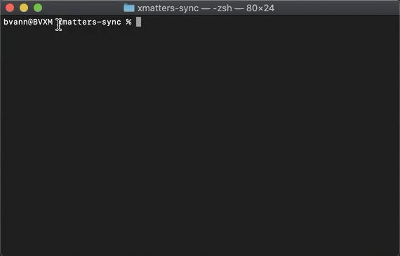

# xmatters-sync

xmatters-sync is a node.js based xMatters data synchronization process built on [xmtoolbox](https://www.npmjs.com/package/xmtoolbox). It provides a configuration based sync implementation to periodically synchronize CSV or JSON files containing user, device, group, group member, and site data into xMatters.

## Setup

1. Download (or clone) this package to a local directory.
1. Install Node from <https://nodejs.org>.
1. Open the this package directory in terminal/command prompt and run `npm install`.
1. Import the workflow as described in [xMatters Workflow](#xmatters-workflow).
1. Configure the sync as described in the [Configuration](#configuration) section.
1. Run sync `npm run sync` from the terminal.

## Configuration

The [xmatters-sync configurator](configurator.html) has been provided to assist in the configuration of xmatters-sync. Simply open the [configurator.html](configurator.html) with a browser. This html-based configuration tool provides a user interface to configure the sync. The output from this tool is the config.json. The configurator may be loaded on the same machine running xmatters-sync (in the case of headless servers) or a different one and does not require a web server to host the html file.

The configuration for xmatters-sync is provided in two files: [config.json](#configjson) and [config.js](#configjs). The [config.js](#configjs) is used to advanced installations. The options for both are provided below. config.json and config.js should be placed in the main project directory of xmatters-sync (the same location as this README.md file).

### config.json

The config.json file is a JSON formatted file which contains the configuration for the sync. It provides the ability to modify what and how data is synchronized into xMatters. The config.json should be placed in the main directory of this project (same location as this README.md). An abbreviated example is provided:

    {
        "subdomain": "company",
        "username": "sync-user",
        "workflowEndpoint": "/api/integration/1/functions/56ce9e18-fa56-4dba-bcf3-e5f8027d4c1f/triggers",
        "backup": "7d",
        "logs": "7d",
        "continueOnError": true,
        "users": {
            "sync": true,
            ...
        },
        ...
    }

The configuration options are below.

| option            | description                                                                                                                                                                                                                                                                                                                                                                                                                                                                                                                                           | required? | default     |
| ----------------- | ----------------------------------------------------------------------------------------------------------------------------------------------------------------------------------------------------------------------------------------------------------------------------------------------------------------------------------------------------------------------------------------------------------------------------------------------------------------------------------------------------------------------------------------------------- | --------- | ----------- |
| subdomain         | The xMatters subdomain to sync to. company if your URL is company.xmatters.com. Ex: 'company' from company.xmatters.com.                                                                                                                                                                                                                                                                                                                                                                                                                              | required  | `undefined` |
| username          | The xMatters user you will use to perform the sync. This can also be an API Key. Should have the role `REST Web Service User`.                                                                                                                                                                                                                                                                                                                                                                                                                       | optional  | `undefined` |
| password          | The xMatters user password, api key secret, or encryption key if the .xmpw file has been defined. To encrypt the password, see [Encrypt the password](#encrypt-xmatters-passwordapi-key-secret).                                                                                                                                                                                                                                                                                                                                                      | optional  | `undefined` |
| logLevel          | The output log level. One of: `"silent"`,`"error"`,`"warn"`,`"info"`,`"debug"`.                                                                                                                                                                                                                                                                                                                                                                                                                                                                       | optional  | `"info"`    |
| dryRun            | When dryRun is enabled records in xMatters will not be created, updated, or deleted.                                                                                                                                                                                                                                                                                                                                                                                                                                                                       | optional  | `false`     |
| mirrorTag         | Used for mirror mode to identify objects owned by this sync. Specify for each subsequent sync if multiple mirror syncs are targeting a single xMatters instance. Multiple mirror syncs targeting the same object in the same instance should be avoided.                                                                                                                                                                                                                                                                                                                                                                                   | optional  | `"XMSYNC_"` |
| workflowEndpoint  | The endpoint for workflow. ex: '/api/integration/1/functions/56ce9e18-fa56-4dba-bcf3-e5f8027d4c1f/triggers'. See #workflow setup for more details on setting up your workflow. When omitted the report is not sent to xMatters.                                                                                                                                                                                                                                                                                                                       | optional  | `undefined` |
| summaryRecipients | A string targetName or an array of xMatters targetNames to receive the xMatters summary notifications after sync runs. Does not support targetNames containing commas. Applies only when the workflow is enabled using the `workflowEndpoint`.                                                                                                                                                                                                                                                                                                        | optional  | `undefined` |
| backup            | One of `false`, `true`, `"7d"`, or `"all"`. Note: true and false are Booleans, not strings. false will not backup any data. Other values will backup the source data (post-processing) and related objects in xMatters prior to running the sync. true saves the last backup from the last time the sync ran and overwrites any previous backup. '7d' saves the last backup each day for 7 days and overwrites after 7 days. 'all' writes a backup each time the sync runs. In the case of 'all', file management is recommended outside of the sync. | optional  | `"7d"`      |
| logs              | One of `false`, `true`, `"7d"`, or `"all"`. Note: true and false are Booleans, not strings. false will not write any logs. Other values will write logs to the logs directory each run. true saves the last logs from the last time the sync ran and overwrites any previous logs. '7d' saves the last logs each day for 7 days and overwrites after 7 days. 'all' writes logs each time the sync runs. In the case of 'all', file management is recommended outside of the sync.                                                                     | optional  | `"7d"`      |
| continueOnError   | When set to true sync will continue when api errors are encountered. When set to false, when an error is encountered after retrying(where appropriate) the sync will terminate.                                                                                                                                                                                                                                                                                                                                                                       | optional  | `false`     |
| proxy | Enable or disable the proxy configuration.                                                                                                                                                                                                                                                                                                     | optional  | `undefined` |
| proxyHost | The hostname or ip address of the proxy.                                                                                                                                                                                                                                                                                                 | Required if proxy is enabled. | `undefined` |
| proxy | The post of the proxy.                                                                                                                                                                                                                                                                                                    | required if proxy is enabled.  | `undefined` |
| users             | Configuration object for synchronizing users/people. See [users](#users) for available options.                                                                                                                                                                                                                                                                                                                                                                                                                                                       | optional  | `undefined` |
| devices           | Configuration object for synchronizing devices. See [devices](#devices) for available options.                                                                                                                                                                                                                                                                                                                                                                                                                                                        | optional  | `undefined` |
| groups            | Configuration object for synchronizing groups. See [groups](#groups) for available options.                                                                                                                                                                                                                                                                                                                                                                                                                                                           | optional  | `undefined` |
| groupMembers      | Configuration object for synchronizing group members. See [groupMembers](#groupMembers) for available options.                                                                                                                                                                                                                                                                                                                                                                                                                                        | optional  | `undefined` |
| sites             | Configuration object for synchronizing sites. See [sites](#sites) for available options.                                                                                                                                                                                                                                                                                                                                                                                                                                                              | optional  | `undefined` |

### config.js

The config.js is a JavaScript file that allows one to alter the sync through the use of JavaScript functions. The file is optional as well as all of the functions. The exported function names must match the ones examples below.

The transform functions below give you access to all imported data from the input files after it has been processed by the sync based on the configurations in config.json but before the data is processed by xmtoolbox and sent to xMatters. One use of these functions is to transform any mal-formatted data. One [example of this is below](#devicetransform-example). The variable sourceData represents all read data from the input files. The variable destinationData represents the data read from xMatters to support the sync as it is configured. This often includes data beyond what is syncronized to support id matching and other lookups within the sync. Also, sourceData and destinationData are in xMatters format which calls users people.

The preSync function gives you access to the config(json) and ability to perform custom actions before the sync is started. Modifications the config in this function will be processed in the sync. The postSync function gives you access to the sync results and related data to perform custom actions after the sync is complete. Examples: custom xMatters Alerts, custom web hooks to external system, custom reporting.

    exports.preSync = async (config) => {
        //do something interesting before the sync such as update the config or pull data from sources.
    };

    exports.userTransform = (user, sourceData, destinationData) => {
        return user;
    };

    exports.deviceTransform = (device, sourceData, destinationData) => {
        return device;
    };

    exports.groupTransform = (group, sourceData, destinationData) => {
        return group;
    };

    exports.groupMemberTransform = (groupMember, sourceData, destinationData) => {
        return groupMember;
    };

    exports.siteTransform = (site, sourceData, destinationData) => {
        return site;
    };

    exports.postSync = async (results, data, config, xmSummary, env) => {
        //do something interesting with sync results.
    };

#### deviceTransform Example

    exports.deviceTransform = (device, index, devices) => {
        //if device has a phoneNumber
        if (device.phoneNumber) {
            //if phone number has an extension defined
            if (device.phoneNumber.indexOf('ext:') > -1) {
                //redefine the extension to the xMatters format: +1 1234567;ext=1234
                let parts = device.phoneNumber.split('ext:').map(p => p.trim());
                device.phoneNumber = parts[0] + ';ext=' + parts[1];
            }

            //add a + if the phone number doesn't already have it.
            if (!device.phoneNumber.startsWith('+')) {
                device.phoneNumber = '+' + device.phoneNumber;
            }

            //remove everything except +, numbers, and ;ext=.
            // ex: '+1#(404).123www-4567;ext=123' becomes '+14041234567;ext=123'
            device.phoneNumber = device.phoneNumber.replace(';ext=', "++").replace(/[^+\d]/g, "").replace('++', ";ext=");
        }

        return device;
    };

### users

Below are the user specific sync configuration options.

| option                 | description                                                                 | required? | default     |
| ---------------------- | --------------------------------------------------------------------------- | --------- | ----------- |
| sync                   | Whether or not to synchronize users.                                        | optional  | `false`     |
| inputPath              | The path to the input file containing users. See [inputPath](#inputPath).   | optional  | `undefined` |
| mirrorMode             | See [mirrorMode](#mirrorMode).                                              | optional  | `false`     |
| processInput           | Set to string name of column. See [processInput](#processInput).            | optional  | `undefined` |
| processDeleteValue     | Set to string. See [processDeleteValue](#processDeleteValue).               | optional  | `undefined` |
| minimum                | See [minimum](#minimum).                                                    | optional  | `undefined` |
| maximum                | See [maximum](#maximum).                                                    | optional  | `undefined` |
| maxDelete              | See [maxDelete](#maxDelete).                                                | optional  | `undefined` |
| include                | See [include](#include).                                                    | optional  | `undefined` |
| properties             | Set to array of property objects. See [properties](#usersproperties).       | optional  | `undefined` |
| externallyOwnedDefault | See [Default](#Default).                                                    | optional  | `undefined` |
| externallyOwnedInitial | See [Initial](#Initial).                                                    | optional  | `undefined` |
| externallyOwnedInput   | See [Input](#Input).                                                        | optional  | `undefined` |
| firstNameDefault       | See [Default](#Default).                                                    | optional  | `undefined` |
| firstNameInitial       | See [Initial](#Initial).                                                    | optional  | `undefined` |
| firstNameInput         | See [Input](#Input).                                                        | optional  | `undefined` |
| languageDefault        | See [Default](#Default).                                                    | optional  | `undefined` |
| languageInitial        | See [Initial](#Initial).                                                    | optional  | `undefined` |
| languageInput          | See [Input](#Input).                                                        | optional  | `undefined` |
| lastNameDefault        | See [Default](#Default).                                                    | optional  | `undefined` |
| lastNameInitial        | See [Initial](#Initial).                                                    | optional  | `undefined` |
| lastNameInput          | See [Input](#Input).                                                        | optional  | `undefined` |
| phoneLoginInput        | See [Input](#Input).                                                        | optional  | `undefined` |
| rolesDefault           | See [Default](#Default).                                                    | optional  | `undefined` |
| rolesDelimiter         | The delimiter used to separate multiple roles supplied for each user.       | optional  | `"|"`       |
| rolesInitial           | An array of role names. See [Initial](#Initial).                            | optional  | `undefined` |
| rolesInput             | An array of role names. See [Input](#Input).                                | optional  | `undefined` |
| siteDefault            | See [Default](#Default).                                                    | optional  | `undefined` |
| siteInitial            | See [Initial](#Initial).                                                    | optional  | `undefined` |
| siteInput              | See [Input](#Input).                                                        | optional  | `undefined` |
| siteCreate              | Automatically create a user's site if it does not exist. Cannot be enabled with `sites.sync`.                     | optional  | `undefined` |
| statusDefault          | See [Default](#Default).                                                    | optional  | `undefined` |
| statusInitial          | See [Initial](#Initial).                                                    | optional  | `undefined` |
| statusInput            | See [Input](#Input).                                                        | optional  | `undefined` |
| supervisorsDefault     | See [Default](#Default).                                                    | optional  | `undefined` |
| supervisorsDelimiter   | The delimiter used to separate multiple supervisors supplied for each user. | optional  | `"|"`       |
| supervisorsInitial     | An array of supervisor targetNames. See [Initial](#Initial).                | optional  | `undefined` |
| supervisorsInput       | An array of supervisor targetNames. See [Input](#Input).                    | optional  | `undefined` |
| targetNameInput        | See [Input](#Input).                                                        | optional  | `undefined` |
| timezoneDefault        | See [Default](#Default).                                                    | optional  | `undefined` |
| timezoneInitial        | See [Initial](#Initial).                                                    | optional  | `undefined` |
| timezoneInput          | See [Input](#Input).                                                        | optional  | `undefined` |
| webLoginInput          | See [Input](#Input).                                                        | optional  | `undefined` |

### devices

Below are the device specific sync configuration options.

| option                | description                                                                                                                                  | required? | default     |
| --------------------- | -------------------------------------------------------------------------------------------------------------------------------------------- | --------- | ----------- |
| sync                  | Whether or not to synchronize devices.                                                                                                       | optional  | `false`     |
| inputPath             | The path to the input file containing devices. See [inputPath](#inputPath).                                                                  | optional  | `undefined` |
| mirrorMode            | See [mirrorMode](#mirrorMode).                                                                                                               | optional  | `false`     |
| processInput          | Set to string name of column. See [processInput](#processInput).                                                                             | optional  | `undefined` |
| processDeleteValue    | Set to string. See [processDeleteValue](#processDeleteValue).                                                                                | optional  | `undefined` |
| maximum               | See [minimum](#minimum).                                                                                                                     | optional  | `undefined` |
| minimum               | See [maximum](#maximum).                                                                                                                     | optional  | `undefined` |
| maxDelete             | See [maxDelete](#maxDelete).                                                                                                                 | optional  | `undefined` |
| include               | See [include](#include).                                                                                                                     | optional  | `undefined` |
| ownerInput            | The xMatters targetName of the device Owner. This is optional but must be set for each device if synchronizing devices. See [Input](#Input). | optional  | `undefined` |
| priorityThresholdSync | Whether or not to sync priorityThreshold for all devices or not.                                                                             | optional  | `false`     |
| delaySync             | Whether or not to sync delay for all devices or not.                                                                                         | optional  | `false`     |
| externallyOwnedSync   | Whether or not to sync delay for all devices or not.                                                                                         | optional  | `false`     |
| sequenceSync          | Whether or not to sync sequence for all devices or not.                                                                                      | optional  | `false`     |
| devices               | Set to array of device objects. See [devices](#devicesdevices).                                                                              | optional  | `undefined` |

### groups

Below are the group specific sync configuration options.

| option                   | description                                                                  | required? | default     |
| ------------------------ | ---------------------------------------------------------------------------- | --------- | ----------- |
| sync                     | Whether or not to synchronize groups.                                        | optional  | `false`     |
| inputPath                | The path to the input file containing groups. See [inputPath](#inputPath).   | optional  | `undefined` |
| mirrorMode               | See [mirrorMode](#mirrorMode).                                               | optional  | `false`     |
| processInput             | Set to string name of column. See [processInput](#processInput).             | optional  | `undefined` |
| processDeleteValue       | Set to string. See [processDeleteValue](#processDeleteValue).                | optional  | `undefined` |
| maximum                  | See [minimum](#minimum).                                                     | optional  | `undefined` |
| minimum                  | See [maximum](#maximum).                                                     | optional  | `undefined` |
| maxDelete                | See [maxDelete](#maxDelete).                                                 | optional  | `undefined` |
| include                  | See [include](#include).                                                     | optional  | `undefined` |
| allowDuplicatesDefault   | See [Default](#Default).                                                     | optional  | `undefined` |
| allowDuplicatesInitial   | See [Initial](#Initial).                                                     | optional  | `undefined` |
| allowDuplicatesInput     | See [Input](#Input).                                                         | optional  | `undefined` |
| descriptionDefault       | See [Default](#Default).                                                     | optional  | `undefined` |
| descriptionInitial       | See [Initial](#Initial).                                                     | optional  | `undefined` |
| descriptionInput         | See [Input](#Input).                                                         | optional  | `undefined` |
| externallyOwnedDefault   | See [Default](#Default).                                                     | optional  | `undefined` |
| externallyOwnedInitial   | See [Initial](#Initial).                                                     | optional  | `undefined` |
| externallyOwnedInput     | See [Input](#Input).                                                         | optional  | `undefined` |
| nameInput                | See [Input](#Input).                                                         | optional  | `undefined` |
| observedByAllDefault     | See [Default](#Default).                                                     | optional  | `undefined` |
| observedByAllInitial     | See [Initial](#Initial).                                                     | optional  | `undefined` |
| observedByAllInput       | See [Input](#Input).                                                         | optional  | `undefined` |
| observersDefault       | See [Default](#Default).                                                     | optional  | `undefined` |
| observersDelimiter     | The delimiter used to separate multiple observers supplied for each group. | optional  | `"|"`       |
| observersInitial       | See [Initial](#Initial).                                                     | optional  | `undefined` |
| observersInput         | See [Input](#Input).
| statusDefault            | See [Default](#Default).                                                     | optional  | `undefined` |
| statusInitial            | See [Initial](#Initial).                                                     | optional  | `undefined` |
| statusInput              | See [Input](#Input).                                                         | optional  | `undefined` |
| supervisorsDefault       | See [Default](#Default).                                                     | optional  | `undefined` |
| supervisorsDelimiter     | The delimiter used to separate multiple supervisors supplied for each group. | optional  | `"|"`       |
| supervisorsInitial       | See [Initial](#Initial).                                                     | optional  | `undefined` |
| supervisorsInput         | See [Input](#Input).                                                         | optional  | `undefined` |
| useDefaultDevicesDefault | See [Default](#Default).                                                     | optional  | `undefined` |
| useDefaultDevicesInput   | See [Input](#Input).                                                         | optional  | `undefined` |
| useDefaultDevicesInitial | See [Initial](#Initial).                                                     | optional  | `undefined` |

### groupMembers

Below are the group member specific sync configuration options. Group members are added to a group but not a shift via the sync. They may be added to a shift(s) later within xMatters. Group member input data may be provided where each input record contains all of a group's members or where each member is a separate record in the input file.

| option             | description                                                                       | required? | default     |
| ------------------ | --------------------------------------------------------------------------------- | --------- | ----------- |
| sync               | Whether or not to synchronize group members.                                      | optional  | `false`     |
| inputPath          | The path to the input file containing group members. See [inputPath](#inputPath). | optional  | `undefined` |
| mirrorMode         | groupMembers mirrorMode requires group sync. Groups not included in the sync will be ignored. Groups included in the sync will match all members with the groupMember input file by adding and removing groupMembers. If groups.mirrorMode is not enabled removing all group members from a group will retain all previous group members unless the group is included without members.                                                     | optional  | `false`     |
| processInput       | Set to string name of column. See [processInput](#processInput).                  | optional  | `undefined` |
| processDeleteValue | Set to string. See [processDeleteValue](#processDeleteValue).                     | optional  | `undefined` |
| maximum            | See [minimum](#minimum).                                                          | optional  | `undefined` |
| minimum            | See [maximum](#maximum).                                                          | optional  | `undefined` |
| maxDelete          | See [maxDelete](#maxDelete).                                                      | optional  | `undefined` |
| include            | See [include](#include).                                                          | optional  | `undefined` |
| groupInput         | See [Input](#Input).                                                              | optional  | `undefined` |
| membersDelimiter   | The delimiter used to separate multiple members supplied for each group.          | optional  | `"|"`       |
| membersInput       | See [Input](#Input).                                                              | optional  | `undefined` |

### sites

Below are the site specific sync configuration options.

| option                 | description                                                               | required? | default     |
| ---------------------- | ------------------------------------------------------------------------- | --------- | ----------- |
| sync                   | Whether or not to synchronize sites.                                      | optional  | `false`     |
| inputPath              | The path to the input file containing sites. See [inputPath](#inputPath). | optional  | `undefined` |
| mirrorMode             | See [mirrorMode](#mirrorMode).                                            | optional  | `false`     |
| processInput           | Set to string name of column. See [processInput](#processInput).          | optional  | `undefined` |
| processDeleteValue     | Set to string. See [processDeleteValue](#processDeleteValue).             | optional  | `undefined` |
| maximum                | See [minimum](#minimum).                                                  | optional  | `undefined` |
| minimum                | See [maximum](#maximum).                                                  | optional  | `undefined` |
| maxDelete              | See [maxDelete](#maxDelete).                                              | optional  | `undefined` |
| include                | See [include](#include).                                                  | optional  | `undefined` |
| address1Default        | See [Default](#Default).                                                  | optional  | `undefined` |
| address1Initial        | See [Initial](#Initial).                                                  | optional  | `undefined` |
| address1Input          | See [Input](#Input).                                                      | optional  | `undefined` |
| address2Default        | See [Default](#Default).                                                  | optional  | `undefined` |
| address2Initial        | See [Initial](#Initial).                                                  | optional  | `undefined` |
| address2Input          | See [Input](#Input).                                                      | optional  | `undefined` |
| cityDefault            | See [Default](#Default).                                                  | optional  | `undefined` |
| cityInitial            | See [Initial](#Initial).                                                  | optional  | `undefined` |
| cityInput              | See [Input](#Input).                                                      | optional  | `undefined` |
| countryDefault         | See [Default](#Default).                                                  | optional  | `undefined` |
| countryInitial         | See [Initial](#Initial).                                                  | optional  | `undefined` |
| countryInput           | See [Input](#Input).                                                      | optional  | `undefined` |
| externallyOwnedDefault | See [Default](#Default).                                                  | optional  | `undefined` |
| externallyOwnedInitial | See [Initial](#Initial).                                                  | optional  | `undefined` |
| externallyOwnedInput   | See [Input](#Input).                                                      | optional  | `undefined` |
| languageDefault        | See [Default](#Default).                                                  | optional  | `undefined` |
| languageInitial        | See [Initial](#Initial).                                                  | optional  | `undefined` |
| languageInput          | See [Input](#Input).                                                      | optional  | `undefined` |
| latitudeDefault        | See [Default](#Default).                                                  | optional  | `undefined` |
| latitudeInitial        | See [Initial](#Initial).                                                  | optional  | `undefined` |
| latitudeInput          | See [Input](#Input).                                                      | optional  | `undefined` |
| longitudeDefault       | See [Default](#Default).                                                  | optional  | `undefined` |
| longitudeInitial       | See [Initial](#Initial).                                                  | optional  | `undefined` |
| longitudeInput         | See [Input](#Input).                                                      | optional  | `undefined` |
| nameInput              | See [Input](#Input).                                                      | optional  | `undefined` |
| postalCodeDefault      | See [Default](#Default).                                                  | optional  | `undefined` |
| postalCodeInitial      | See [Initial](#Initial).                                                  | optional  | `undefined` |
| postalCodeInput        | See [Input](#Input).                                                      | optional  | `undefined` |
| stateDefault           | See [Default](#Default).                                                  | optional  | `undefined` |
| stateInitial           | See [Initial](#Initial).                                                  | optional  | `undefined` |
| stateInput             | See [Input](#Input).                                                      | optional  | `undefined` |
| statusDefault          | See [Default](#Default).                                                  | optional  | `undefined` |
| statusInitial          | See [Initial](#Initial).                                                  | optional  | `undefined` |
| statusInput            | See [Input](#Input).                                                      | optional  | `undefined` |
| timezoneDefault        | See [Default](#Default).                                                  | optional  | `undefined` |
| timezoneInitial        | See [Initial](#Initial).                                                  | optional  | `undefined` |
| timezoneInput          | See [Input](#Input).                                                      | optional  | `undefined` |

### inputPath

inputPath is string that represents the file path to the input file containing data to synchronize into xMatters. This file can be any of the following formats:

-   Comma Separated Values (.csv) with the first row being the header row and each row after that representing a record.
-   JavaScript Object Notation (.json) in the format of an array of objects where each object is a record.

### Input

Input refers to configuration options that specify the field from the input file for a field on the xMatters record. Input options are usually specified using the xMatters api key name with the Input suffix. For example, to set a user's site value from a input field/column of 'Site' you would set the siteInput in the users options to 'Site'.

### Default

Default refers to configuration options that specify the value that will be used each time the sync runs unless a value is found in the corresponding Input for a record. Default options are usually specified using the xMatters api key name with the Default suffix. For example, to set a user's default site to the standard 'Default Site' you would set the siteDefault in the users options to 'Default Site'. There is another related option called [Initial](#Initial). Please review that option as well.

### Initial

Initial refers to configuration options that specify the value that will be set only when the record is added to xMatters. This option only applies when the corresponding Input is not specified. Initial options are usually specified using the xMatters api key name with the Initial suffix. For example, to set a user's initial site to the standard 'Default Site' you would set the siteInitial in the users options to 'Default Site'. There is another related option called [Default](#Default). Please review that option as well.

### mirrorMode

Set to one of `false`, `true`, or `"greedy"`. If you are supplying a file that contains all records that should be in xMatters then you are operating in mirror mode. If you are supplying a file that contains a column that specifies whether a record should be added/removed from xMatters, only adding/updating records, or other wise not supplying all records that should exist in xMatters, you are operating in non-mirror mode and the option should be omitted or set to `false`.

Mirror mode allows the file to add/update records by including the record in the file and deletes records when not including them on subsequent runs of the sync process. When setting mirrorMode to `true` the sync will only add, update, or delete records initially added by the sync process or another process using a matching `mirrorTag`. Setting `mirrorMode` to `"greedy"` will allow it to take ownership of any matching records already in xMatters. `"greedy"` should be used initially when implementing sync if records exist in xMatters that should be owned by the sync process. However, it is recommended to switch mirrorMode to true on subsequent runs to as this option adds significant overhead and processing time to the sync (~5min / 150k records). `"greedy"` should also be set if the value of `mirrorTag` is changed after running the sync to allow the sync process to take ownership of the records again.

### maximum

In mirror mode the `maximum` specifies the maximum quantity of objects allowed by the sync. If the quantity of objects included in the input file exceeds the maximum the sync will terminate. Typically, this setting is applied to users configuration and set to less than or equal to the total number of licenses. Non-mirror mode support is not available.

### maxDelete

In non-mirror mode `maxDelete` specifies the maximum quantity of objects that may be set to be deleted with a single input file. This option is often used to prevent invalid data input files from deleting more records than are expected to be deleted with one file. Mirror mode support is not available.

### minimum

In mirror mode the `minimum` specifies the minimum quantity of objects allowed by the sync. If the quantity of objects included in the input file is less than the minimum the input data is identified as invalid and the sync will terminate. Non-mirror mode support is not available.

### processInput

In non-mirror mode, input field to specify the operation for records in non-mirror mode. In non-mirror mode the assumption is that the record should be added or updated unless the `processDeleteValue` is specified and matched. If a column is not specified, records are always added or updated.

### processDeleteValue

In non-mirror mode, the value in the `processInput` field to be interpreted as a delete operation for the record. If not specified, records are always added or updated.

### include

Set to a string or an array of strings. The include option allows you to include values from the record that do not directly map to an xMatters property but you want to include it so that it can be leveraged in the [config.js](#configjs) transform functions. Sometimes phone number extensions are in a separate column. The include option could be leveraged to pull the extension into each record. In the device transform they could be added to the `phoneNumber` field following the xMatters required format.

### users.properties

This option is specific to users and can be used to synchronize user properties/custom fields. The example below would synchronize a custom field that exists in xMatters called 'Division' from an input field called 'Division'.

    [{"input": "Division"}]

You may specify each custom field to be synchronized. `input` is the only required field but a number of options exist for each property/custom field which are specified below. To add additional properties, simply add another to the array above in the config.json like:

    [{"input": "Division"},{"input": "Building"}]

| option    | description                                                                                                                                                                                                                                                                                                                                       | required? | default     |
| --------- | ------------------------------------------------------------------------------------------------------------------------------------------------------------------------------------------------------------------------------------------------------------------------------------------------------------------------------------------------- | --------- | ----------- |
| input     | Property input. See [input](#input).                                                                                                                                                                                                                                                                                                              | required  | `undefined` |
| name      | The name of the custom field in xMatters, if different than the input.                                                                                                                                                                                                                                                                            | optional  | input value |
| default   | Property default. See [Default](#Default) If you have people with loaded custom fields that you intend to sync, Text type might have been set to and empty string. If so, you should set the default for that custom field to be and empty string. A value of null will remove the property and is only available on non-mandatory custom fields. | optional  | `undefined` |
| delimiter | Delimiter for any custom attributes. If the property is a custom field do not set this value.                                                                                                                                                                                                                                                     | optional  | `undefined` |

### devices.devices

This option is specific to devices to synchronize from the devices input.

You may specify each device to be synchronized. `input` is the only required field but a number of options exist for each property/custom field which are specified below. This example will synchronize in Work Email and Work Phone from fields/columns in the input to devices in xMatters with the same name.

    [{"input": "Work Email"},{"input": "Work Phone", "deviceType": "VOICE"}]

| option                   | description                                                                                                                                                                                                                                                                                                     | required? | default     |
| ------------------------ | --------------------------------------------------------------------------------------------------------------------------------------------------------------------------------------------------------------------------------------------------------------------------------------------------------------- | --------- | ----------- |
| input                    | The name of the field in the input file containing the phone number of email address.                                                                                                                                                                                                                           | required  | `undefined` |
| name                     | The name of the custom field in xMatters, if different than input.                                                                                                                                                                                                                                              | optional  | input value |
| deviceType               | One of `"EMAIL"`,`"VOICE"`, or `"TEXT_PHONE"` matching the xMatters [device type](https://help.xmatters.com/xmapi/index.html#create-a-device).                                                                                                                                                                  | optional  | `"EMAIL"`   |
| delayDefault             | Applies only if delaySync is enabled. See [Default](#Default).                                                                                                                                                                                                                                                  | optional  | `undefined` |
| delayInput               | Applies only if delaySync is enabled. See [Input](#Input).                                                                                                                                                                                                                                                      | optional  | `undefined` |
| delayInitial             | See [Initial](#Initial).                                                                                                                                                                                                                                                                                        | optional  | `undefined` |
| sequenceDefault          | Applies only if sequenceSync is enabled. Value is used to order synced devices for an owner. Actual xMatters sequence values are applied based the device's location in the sorted devices. This sorting does not account for devices that may exist in xMatters outside of this sync. See [Default](#Default). | optional  | `undefined` |
| sequenceInput            | Applies only if sequenceSync is enabled. Value is used to order synced devices for an owner. Actual xMatters sequence values are applied based the device's location in the sorted devices. This sorting does not account for devices that may exist in xMatters outside of this sync. See [Input](#Input).     | optional  | `undefined` |
| sequenceInitial          | See [Initial](#Initial) Unlike the sequenceDefault and sequenceInput values, sequenceInitial is applied without modification directly to xMatters.                                                                                                                                                              | optional  | `undefined` |
| priorityThresholdDefault | Applies only if priorityThresholdSync is enabled. See [Default](#Default).                                                                                                                                                                                                                                      | optional  | `undefined` |
| priorityThresholdInput   | Applies only if priorityThresholdSync is enabled. See [Input](#Input).                                                                                                                                                                                                                                          | optional  | `undefined` |
| priorityThresholdInitial | See [Initial](#Initial).                                                                                                                                                                                                                                                                                        | optional  | `undefined` |
| externallyOwnedDefault   | Applies only if externallyOwnedSync is enabled. See [Default](#Default).                                                                                                                                                                                                                                        | optional  | `undefined` |
| externallyOwnedInput     | Applies only if externallyOwnedSync is enabled. See [Input](#Input).                                                                                                                                                                                                                                            | optional  | `undefined` |
| externallyOwnedInitial   | See [Initial](#Initial).                                                                                                                                                                                                                                                                                        |

### Encrypt xMatters Password/API Key Secret

A xmtoolbox .xmpw file is an aes-256-gcm encrypted file that contains your xMatters password for each xMatters instance. A 32 character key is used to encrypt the file and must be provided to xmtoolbox via the password field or environment variable that is provided after following the instructions below.

To create encrypted xmtoolbox .xmpw file to store your password in encrypted format for each xMatters instance.

1. Run `npx create-xmpw` from this project directory.
1. Provide your xMatters subdomain. ex: company if your url is company.xmatters.com.
1. Provide your xMatters password.
1. Provide your 32 character key. Keys longer than 32 characters are truncated.

After following the steps above, the file is written to project directory with a name similar to the subdomain with extension `.xmpw`. The key may be provided in the password field or the environment variable given in the output after following the steps above.

## xMatters Workflow

The xMatters workflow is used to receive notifications and alerts related to the xmatters-sync. This workflow is not required but if implemented allow xMatters users to receive notifications related to the sync.

### Workflow Setup

1. Browse to Workflows in your xMatters Instance.
1. Click import and import the `/xmatters_files/xmatterssync.zip` file from this project.
1. In the imported workflow, ensure the user you will use to run this sync is allowed under each form's Sender Permissions.
1. Open the Sync flow under flows and open the `Sync - xmatters-sync endpoint Settings` (the initial flow module)
1. Copy the initiation URL and use to set your workflowEndpoint in config.json. Only the part from `/api` on is needed however the complete url works as well.

### Sync Summary

The sync summary is a xMatters alert that will provide the results of the sync each time it runs. You may configure the recipients of alert by setting the `summaryRecipients` option or leverage subscriptions in xMatters.
